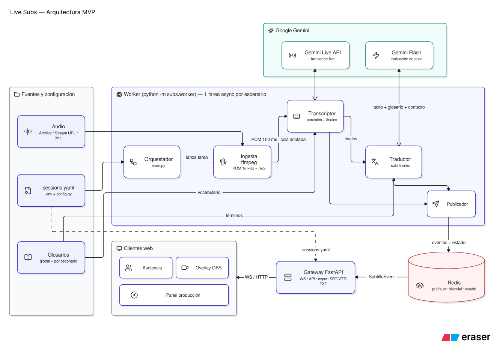

# Live Subs

Live Subs provides real-time subtitles and translation for multiple conference stages. An audience member selects a stage and a subtitle track in a browser; original speech appears as partial and final subtitles, while translations are published for final sentences.

## Demo

Video: [Watch the demo](https://youtu.be/G8bLmZ4n4MU). The video shows a real Nerdearla talk, two stages running in parallel, the English and Spanish translations, the audience page on a phone, and the OBS overlay over the talk video.

## Requirements

- Docker with the Compose plugin.
- A Gemini API key with access to the models configured below, and network access for the worker to call Gemini.

## Quickstart

From the repository root:

```bash
cp .env.example .env
```

Set `GEMINI_API_KEY` in `.env` to your Gemini API key. Keep this file private; only the worker service receives the key. Then start the stack:

```bash
docker compose up --build
```

Open <http://localhost:8000/>. The default `sessions.yaml` starts two looping sample talks: `sala1` (English with Spanish translation) and `sala2` (Spanish with English translation). Select a stage and its original or translated track in the audience page.

## OBS / vMix overlay

To burn subtitles into a livestream, add a Browser Source in OBS (or a Web Browser input in vMix) with, for example:

```text
http://localhost:8000/overlay.html?session=sala2&track=en
```

| Parameter | Default | Values |
| --- | --- | --- |
| `session` | — (required) | A stage `id` from `sessions.yaml` |
| `track` | `original` | `original` or a target language of that stage, such as `es` or `en` |
| `size` | `42` | Font size in px, from 12 to 200 |
| `position` | `bottom` | `bottom` or `top` |
| `partials` | `true` | `false` shows only final sentences |

The background is transparent and there are no controls: the overlay shows up to two lines of white text with a dark outline. It reconnects every 2 seconds if the connection drops. A 1920×1080 source placed over the talk video works well.

## Architecture



The worker reads each stage's file or stream through ffmpeg, sends continuous PCM audio to Gemini Live for transcription, and translates final sentences with Gemini Flash. It publishes subtitle events through Redis. The FastAPI gateway serves the audience page and delivers the selected stage and track over WebSocket. See the [detailed architecture](docs/architecture.md) for design and data-flow details.

The diagram shows the full design. This MVP includes the audience page and the OBS/vMix overlay; the production panel, subtitle history and SRT/VTT/TXT export are planned next.

## Results

Measured on this MVP. Details in [research.md](specs/001-subs-mvp/research.md) and [validation.md](specs/001-subs-mvp/checklists/validation.md).

| Metric | Result | How it was measured |
| --- | --- | --- |
| Partial subtitle | ~1 s (P50) | From the start of speech to the first partial; technical probe with a real Nerdearla talk in English |
| Final sentence | ~1.75 s (P50) | From the end of speech to the final sentence; same probe |
| Translation | ~2.4 s (P50) | From the end of speech to the translated sentence: final plus the `gemini-3.5-flash-lite` call |
| First translated line after opening the page | < 1 s (was 54.9 s) | Headless browser on both translated tracks, from a clean clone |
| Clean clone to subtitles | 34 s to 3 min 18 s | `git clone` to the first subtitle: 34 s with Docker's build cache, 3 min 18 s when the image is built |

## Configuration

The worker reads its settings from `.env`. These model settings are provided in `.env.example`; edit them in `.env` before starting the stack:

| Variable | Default | Purpose |
| --- | --- | --- |
| `TRANSCRIBE_MODEL` | `gemini-3.5-transcribe-live` | Live audio transcription |
| `TRANSLATE_MODEL` | `gemini-3.5-flash-lite` | Translation of final sentences |
| `TRANSLATE_THINKING_LEVEL` | `MINIMAL` | Translation model's thinking level |

The documented translation alternative is `TRANSLATE_MODEL=gemini-3.8-flash` with `TRANSLATE_THINKING_LEVEL=LOW`; change both settings together. The transcription model can be changed through `TRANSCRIBE_MODEL`. The worker receives these values when its container is created, so recreate it after changing `.env`.

Edit [`sessions.yaml`](sessions.yaml) to add or change stages. Each session has a unique `id`, `name`, `title`, `source` (`type` and `uri`), `source_language`, and `target_languages`. Supported sources are `file` and `stream`; file paths are relative to `sessions.yaml`. For a file, `source.loop: true` repeats the talk after it ends; omit it or set it to `false` for a single run. `loop` is not valid for streams. The current configuration contains the two sample stages described above. The Docker image copies `sessions.yaml`, so rebuild the image after editing it for a Compose deployment.

## Scaling stages

A stage is the unit of scale: each stage has its own audio stream and Live transcription session. With an empty `WORKER_SESSIONS` value, the worker serves every stage in `sessions.yaml`. To grow from the two sample stages to 100, add the stage definitions and run, for example, 10 workers with 10 distinct stage IDs assigned to each via its comma-separated `WORKER_SESSIONS` value. Point all workers at the same Redis instance. Gateways are separate from audio processing; run multiple gateway instances behind a load balancer as audience traffic grows.

Each additional target language adds one text translation call per final sentence, rather than another audio session. Capacity and cost depend on your Gemini project's concurrent-session and token quotas; check those limits before scaling.

## How it was built

Live Subs was built with Spec-Driven Development using [Spec Kit](https://github.com/github/spec-kit): a project constitution, then a spec, a plan and a task list, each written before the code. Claude Code and Codex implemented the tasks one at a time, each with a test or a runnable "done when" check. The specification, plan, research, contracts and validation results are in [`specs/001-subs-mvp/`](specs/001-subs-mvp/).

## Sample audio and license

The included English and Spanish OGG/Opus clips are synthetic, generated from the accompanying talk scripts with Gemini TTS. Their model, voices, generation date, and script provenance are recorded in the [sample audio README](samples/audio/README.md).

Live Subs and its sample audio are distributed under the [Apache License 2.0](LICENSE).
